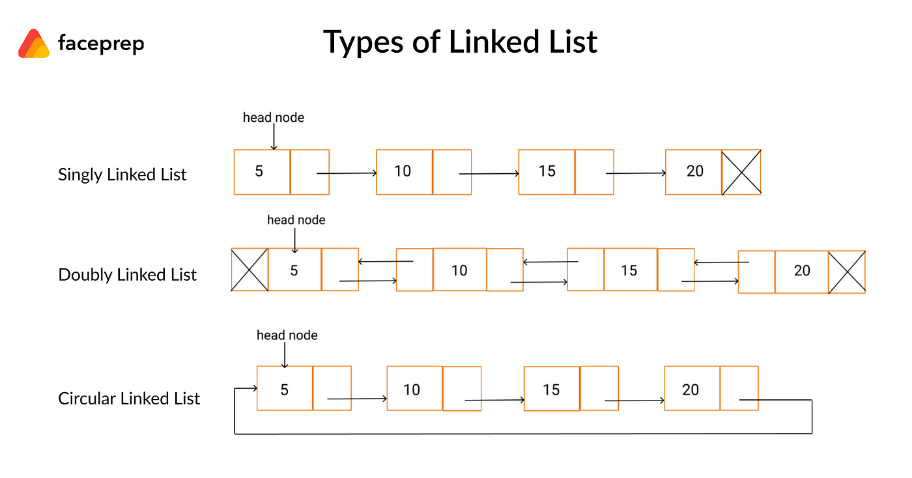

# Linked List
A linked list is a linear data structure consisting of a sequence of elements called nodes. Each node contains two parts:

* Data: The value or information stored in the node.

* Pointer (or reference): A link to the next node in the sequence.

* Unlike arrays, linked lists do not store elements in contiguous memory locations. Instead, each node is dynamically allocated and linked to the next node using pointers.

### Types of Linked Lists
1. Singly Linked List:

* Each node points to the next node.

* The last node points to null (indicating the end of the list).

2. Doubly Linked List:

* Each node has two pointers: one to the next node and one to the previous node.

* Allows traversal in both forward and backward directions.

3. Circular Linked List:

* The last node points back to the first node, forming a loop.

* Can be singly or doubly linked.

### Advantages of Linked Lists
* Dynamic Size:

Linked lists can grow or shrink in size during runtime, unlike arrays, which have a fixed size.

* Efficient Insertions and Deletions:

Adding or removing elements from the beginning or middle of a linked list is more efficient than with arrays because it doesn't require shifting elements.

* Memory Efficiency:

Memory is allocated only when needed, avoiding wasted space.

### Operations on Linked Lists
* Traversal:

Visit each node in the list.

* Insertion:

Insert a node at the beginning, middle, or end of the list.

* Deletion:

Remove a node from the beginning, middle, or end of the list.

* Search:

Find a node with a specific value.

